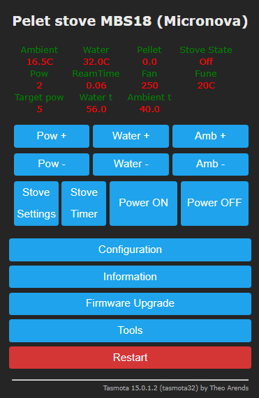
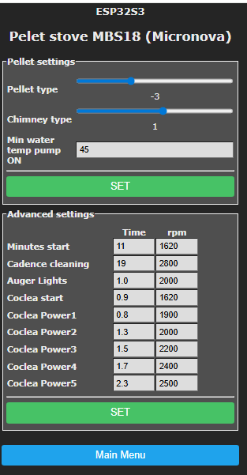
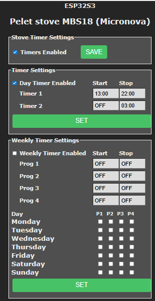

# Micronova Tasmota Scripts

Micronova pellet stove integration scripts for Tasmota (Berry).
This Berry script is for Micronova pellet stoves with board `I023_5`. It reads RAM and EEPROM addresses and publishes data to MQTT through Tasmota.

This is a simple solution. The required hardware is an `ESP32-S3-DevKitC-1` (N8 or N16), one diode, a 20V→5V DC-DC buck converter module, and wiring.

## History

My goal was to connect my pellet stove to IoT with minimal cost, even though Micronova also has its own Wi-Fi adapter.

I started from:

- https://k3a.me/ir-controller-for-pellet-stove-with-micronova-controller-stufe-e-pellet-aria-ir-telecomando/
- https://github.com/eni23/micronova-controller

Those projects were too complex for my needs. I also tried an `Arduino Uno R3 WiFi`, but due to timing issues with `serialSend`, I switched to an `ESP32-C3` board.

The Micronova stove board uses one wire for serial communication with 5v.
 I bridged `TX` and `RX` through a diode to block stove-to-`TX` signaling while still allowing stove-to-`RX` communication. When sending commands on `TX`, the ESP32 also receives an echo of transmitted bytes. The Berry script handles this echo correctly and ignores those echoed bytes.

Thanks to https://github.com/LukasGossmann/MetaboCAS for the diode idea.

I am not sure if this is secure for long-term use, because the ESP32 is 3.3V. From multiple sources, I learned that many ESP32 pins are 5V tolerant, except `Vin`, which should be 3.3V (maximum 3.6V).

I connected everything together, and it has been working well for approximately one month.
Any suggestions are appreciated.

 
Todo list:
- Find the RAM address that holds water pump ON state (if available).
- Recognize more EEPROM addresses.

## Main runtime commands

- `StovePower`
- `TargetWaterTemp`
- `TargetAmbientTemp`
- `TargetPower`
- `StoveWriteEEPROM`
- `StoveWriteRAM`
- `StoveReadEEPROM`
- `StoveReadRAM`

## Safety disclaimer

Changing stove EEPROM values can affect operation and safety. Use tested values only and keep a backup of known-good settings.
